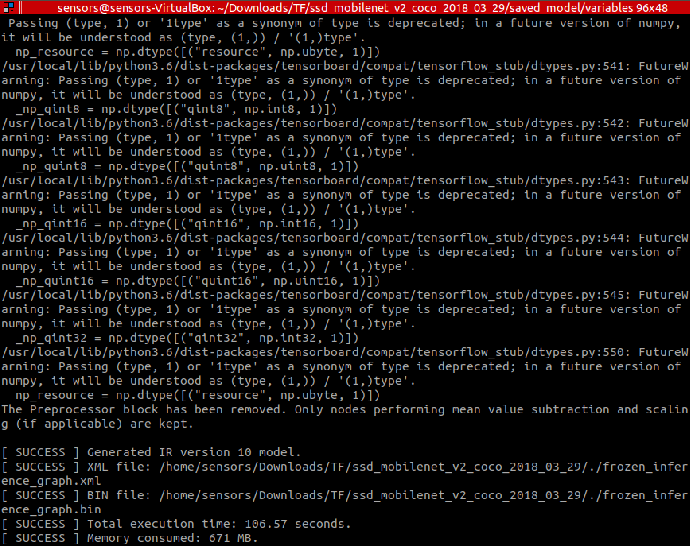

# Day_2
You will need the following for sure =)

### Exercise 4: Converting Tensorflow Model

1. Navigate to `/home/sensors/Downloads/`
2. Create here the folder `TF`
3. Go inside the `TF` folder
4. Download `MobileNet SSD` from the website. To do that type in the terminal: `wget _link_` (instead of `_link_` paste this: http://download.tensorflow.org/models/object_detection/ssd_mobilenet_v2_coco_2018_03_29.tar.gz). 

*Remember, that you need to use `Ctrl+Shift+V` combination to be able to paste the link to the terminal.*

5. After completing the download, use `tar -xvf _the_name_of_the_archive_` to unpack it. (instead of `_the_name_of_the_archive_` use `ssd_mobilenet_v2_coco_2018_03_29.tar.gz`). 

<details><summary>Short info about tar</summary>
<p>

`tar` is command for handling `**.tar.gz` file.

`x:` Extract a tar file.

`v:` Verbose output or show progress while extracting files.

`f:` Specify an archive or a tar filename.

</p>
</details>

*Remember that you do not need to copy the name of the archive from here! Just type* `tar -xvf ssd` *and then press Tab to autofill*

6. Delete the archive `rm _name_of_the_archive_`
7. Navigate to new folder `ssd_mobilenet_v2_coco_2018_03_29`
8. To convert Tensorflow model to Intermediate Representation, use the command: 

```bash
python3 /opt/intel/openvino/deployment_tools/model_optimizer/mo.py \
--input_model frozen_inference_graph.pb \
--tensorflow_object_detection_api_pipeline_config pipeline.config \
--reverse_input_channels \
--tensorflow_use_custom_operations_config /opt/intel/openvino/deployment_tools/model_optimizer/extensions/front/tf/ssd_v2_support.json
```

How is it possible to undetstand such a command :interrobang:

<details><summary>Short info about tar</summary>
<p>

`/opt/intel/openvino/deployment_tools/model_optimizer/mo_tf.py` - the path of the model converter script

`--input_model frozen_inference_graph.pb` - option treats the input model file as a text protobuf format

`--tensorflow_object_detection_api_pipeline_config pipeline.config` - path to the pipeline configuration file used to generate model created with help of Object Detection API.

`--reverse_input_channels` - revert input channels from RGB to BGR due to the TensorFlow models being trained on RGB images, but the Inference Engine otherwise defaulting to BGR.

`--tensorflow_use_custom_operations_config /opt/intel/openvino/deployment_tools/model_optimizer/extensions/front/tf/ssd_v2_support.json` - use the configuration file with custom operation description. (which is also located in 

</p>
</details>

9. If conversion completed successfully you should see something like that: 



10. Check, whether you have `frozen_inference_graph.bin` and `frozen_inference_graph.xml` in your current directory

<details><summary>And finally!!!</summary>
<p>

You have done it! You are amazing! :muscle: :muscle: 

</p>
</details>

